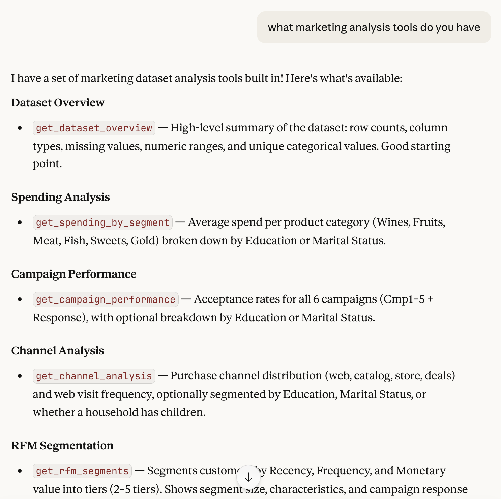
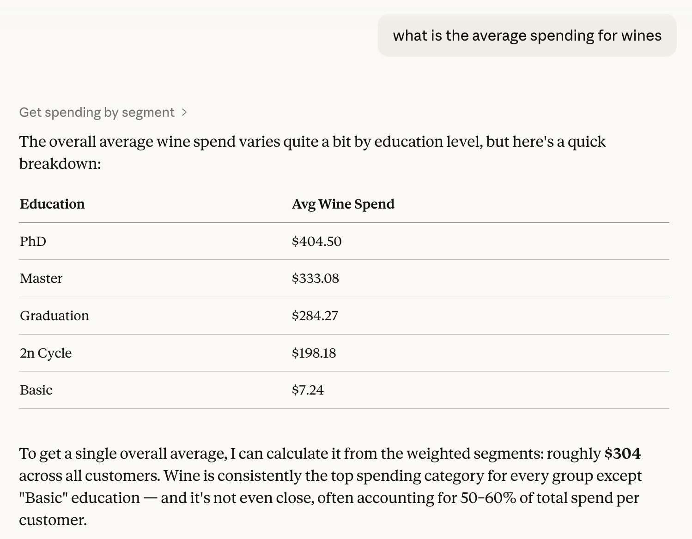
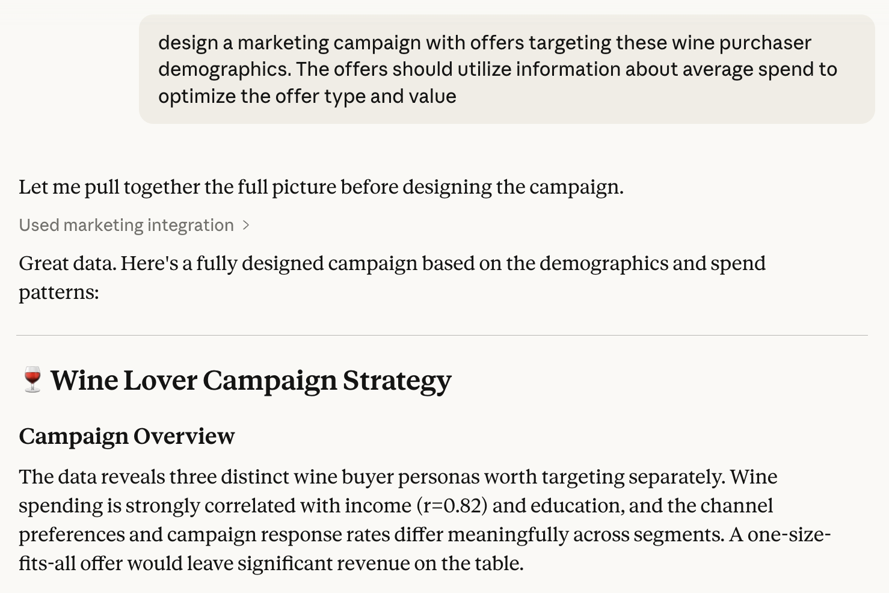
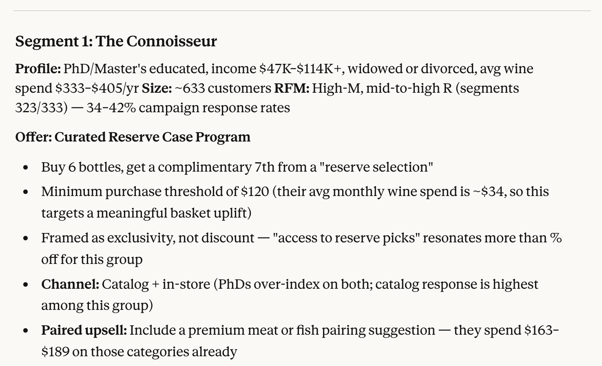
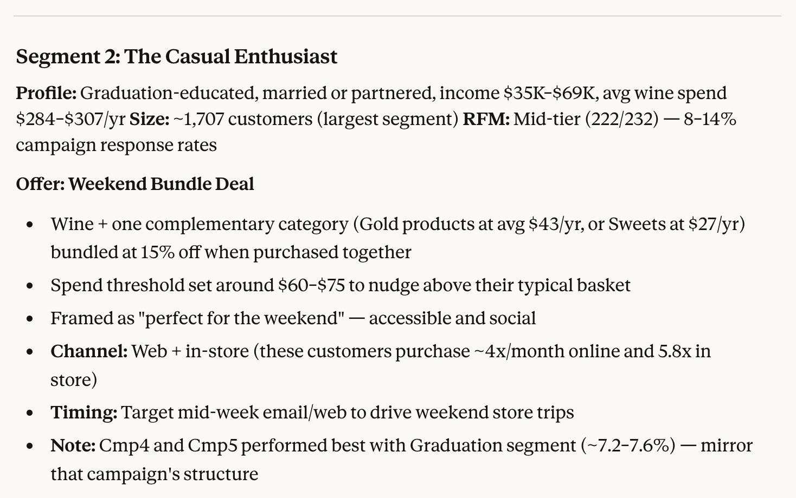
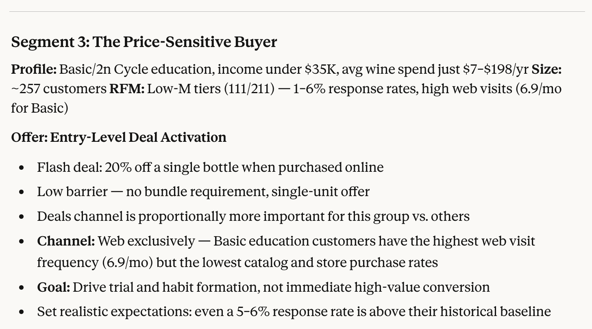
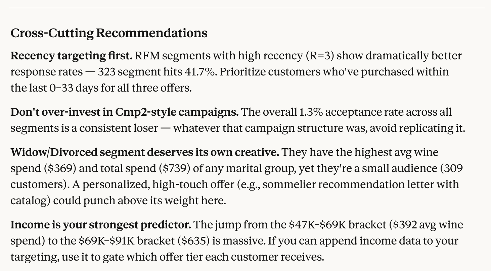

# Marketing Context MCP — Unscripted Agentic Reasoning Experiment

An experiment in giving an AI agent **live, queryable access to a marketing dataset** via a local [Model Context Protocol (MCP)](https://modelcontextprotocol.io) server — so it can reason freely over real data without any pre-written SQL, pre-defined dashboards, or scripted question paths.



---

## The Idea

Most marketing analytics tools are built around scripted queries: you know what question you want answered, you write the query, you get the answer. But what happens when you give an AI agent a set of primitive data tools and let it **figure out its own analytical path**?

This project exposes a marketing campaign dataset as an MCP server. Claude Desktop can then call any combination of the 7 tools, in any order, to answer open-ended questions like:

> *"Which customer segments are underperforming on campaign response rates relative to their spending power?"*

The agent decides which tools to call, in what sequence, and how to synthesize the results — no scripted workflow, no pre-written analysis.

---

## Example Scenario: Unscripted Wine Campaign Design

The following walkthrough shows what unscripted agentic reasoning actually looks like in practice. No analysis was pre-written. The agent was given a single open prompt and used the MCP tools to work through the problem on its own.

**Prompt:** *"What is the average spending for wines? Design a marketing campaign with offers targeting these wine purchaser demographics. The offers should utilise information about average spend to optimize the offer type and value."*

---

**Step 1 — Spending breakdown by segment**

The agent calls `get_spending_by_segment` to understand wine spend across education levels, discovering that PhD customers average $404/yr vs $7 for Basic education — a 56x gap that immediately shapes the segmentation strategy.



---

**Step 2 — Campaign strategy overview**

Rather than stopping at the numbers, the agent synthesises the spending data with income correlation and RFM scores to frame three distinct buyer personas worth targeting separately.



---

**Step 3 — Segment 1: The Connoisseur**

PhD/Master-educated customers (633 people, $333–$405 avg wine spend, high RFM tier). The agent designs a *Curated Reserve Case Program* — buy 6 bottles, get the 7th free — anchored to their actual $34/month spend threshold and their preference for catalog and in-store channels over discounts.



---

**Step 4 — Segment 2: The Casual Enthusiast**

Graduation-educated customers (1,707 people, $284–$307 avg wine spend, mid RFM tier). The agent designs a *Weekend Bundle Deal* — wine plus a complementary category at 15% off — timed to mid-week email to drive weekend store visits, mirroring the Cmp4/Cmp5 structure that performed best for this group.



---

**Step 5 — Segment 3: The Price-Sensitive Buyer**

Basic/2n Cycle-educated customers (257 people, $7–$198 avg wine spend, low RFM tier). The agent designs an *Entry-Level Deal Activation* — a single-bottle flash deal, web-only, no bundle requirement — setting realistic expectations that a 5–6% response rate is already above their historical baseline.



---

**Step 6 — Cross-cutting recommendations**

The agent closes with strategic observations that cut across all three segments: prioritise high-recency customers (RFM R=3 hits 41.7% response), never replicate Cmp2 (1.3% overall), give Widow/Divorced customers their own creative, and use income as a targeting gate where possible.



---

The agent called multiple tools, cross-referenced the outputs, and produced a fully reasoned, data-grounded campaign brief — from a single open question, with no scripted workflow.

---

## Dataset

`marketing_campaign.csv` — a sample dataset downloaded from [Kaggle](https://www.kaggle.com/datasets/imakash3011/customer-personality-analysis) (Customer Personality Analysis). It contains 2,239 customer records across 29 columns covering:

| Category | Columns |
|----------|---------|
| Demographics | `Year_Birth`, `Education`, `Marital_Status`, `Income`, `Kidhome`, `Teenhome` |
| Behavioral | `Recency` (days since last purchase), `Dt_Customer` (registration date) |
| Spending | `MntWines`, `MntFruits`, `MntMeatProducts`, `MntFishProducts`, `MntSweetProducts`, `MntGoldProds` |
| Channels | `NumWebPurchases`, `NumCatalogPurchases`, `NumStorePurchases`, `NumDealsPurchases`, `NumWebVisitsMonth` |
| Campaigns | `AcceptedCmp1`–`AcceptedCmp5`, `Response` (binary 0/1 acceptance) |

---

## MCP Tools

The server exposes 7 analytical tools:

| Tool | What it does |
|------|-------------|
| `get_dataset_overview` | Schema, row counts, missing value counts, numeric ranges, categorical distributions |
| `get_spending_by_segment` | Average spend per product category grouped by Education or Marital Status |
| `get_campaign_performance` | Acceptance rate (%) for all 6 campaigns, overall and by demographic segment |
| `get_channel_analysis` | Purchase channel share (web/catalog/store/deals), optionally by segment |
| `get_rfm_segments` | RFM (Recency, Frequency, Monetary) scoring into configurable tiers |
| `get_income_spend_correlation` | Pearson correlation + bracketed income-vs-spend breakdown |
| `get_customer_tenure_analysis` | Spending and response rates grouped by customer registration tenure cohorts |

Tools are intentionally **primitive and composable** — the agent combines them to answer complex questions rather than any single tool encoding a full analysis.

---

## Architecture

```
Claude Desktop
     │
     │  stdio (subprocess)
     ▼
server.py  ←  marketing_campaign.csv (loaded once at startup)
     │
     └── pandas DataFrame (in-memory, read-only)
```

- **Transport**: stdio — Claude Desktop spawns `server.py` as a local subprocess. No ports, no network exposure.
- **Data layer**: pandas DataFrame loaded once at startup. All tools operate on an in-memory copy.
- **No database**: the CSV is the source of truth.

---

## Setup

### Prerequisites

- Python 3.10+ (tested with 3.11)
- [Claude Desktop](https://claude.ai/download)

### 1. Clone and create a virtual environment

```bash
git clone <this-repo>
cd MarketingMCP
python3.11 -m venv venv
```

### 2. Install dependencies

```bash
./venv/bin/pip install -r requirements.txt
```

### 3. Verify it loads

```bash
./venv/bin/python server.py
# Should block waiting for stdin — press Ctrl+C to exit
# Any import error will print before it blocks
```

### 4. Register with Claude Desktop

Edit `~/Library/Application Support/Claude/claude_desktop_config.json` (macOS) and add:

```json
{
  "mcpServers": {
    "marketing": {
      "command": "/absolute/path/to/MarketingMCP/venv/bin/python",
      "args": ["/absolute/path/to/MarketingMCP/server.py"]
    }
  }
}
```

Use the **absolute path** to the venv Python — not `python3` — so the installed packages are found at launch.

### 5. Restart Claude Desktop

Cmd+Q (full quit) → reopen. The MCP server launches automatically at startup.

---

## Troubleshooting

| Problem | Fix |
|---------|-----|
| Tools don't appear in Claude Desktop | Check `~/Library/Logs/Claude/mcp-server-marketing.log` |
| Import error on startup | Run `./venv/bin/python server.py` directly to see the traceback |
| Invalid config JSON | Run `python3 -c "import json; json.load(open('~/Library/Application Support/Claude/claude_desktop_config.json'))"` |
| CSV not found | `Path(__file__).parent` resolves relative to `server.py` — keep both files in the same directory |

---

## Project Structure

```
MarketingMCP/
├── server.py                 # MCP server — all 7 tools
├── marketing_campaign.csv    # Source dataset (Kaggle)
├── requirements.txt          # mcp, pandas
├── docs/
│   ├── example.png           # Claude Desktop tool listing screenshot
│   ├── wine-scenario-1.png   # Wine spend by education segment
│   ├── wine-scenario-2.png   # Three-segment campaign strategy
│   ├── wine-scenario-3.png   # Segment 1: The Connoisseur
│   ├── wine-scenario-4.png   # Segment 2: The Casual Enthusiast
│   ├── wine-scenario-5.png   # Segment 3: The Price-Sensitive Buyer
│   └── wine-scenario-6.png   # Cross-cutting recommendations
└── README.md
```
